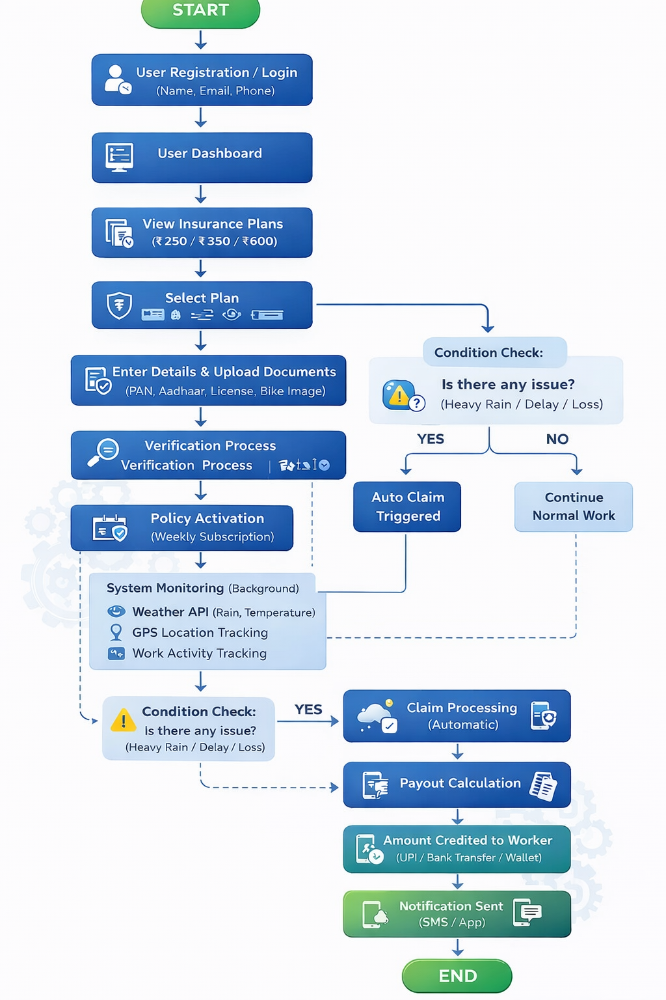

# RAKSHAK — *रक्षक | The Guardian*

### AI-Powered Parametric Income Protection for India's Food Delivery Workforce
**Guidewire DEVTrails 2026 • Phase 1 Submission • March 2026**

---

| 3M+ | 20–30% | ₹0 | Weekly |
|-----|--------|----|--------|
| Active Delivery Partners (Zomato & Swiggy) | Monthly Income Lost to Uncontrollable Disruptions | Current Income Protection Products for Gig Workers | Premium Cycle Aligned with Platform Pay Cycle |

---

## 1. Problem Statement

India's food delivery ecosystem runs on millions of gig workers who accept every order regardless of conditions outside. When the environment turns hostile — monsoon floods, heatwaves, city-wide curfews — these workers face an impossible choice: risk safety or lose income. There is no third option.

Currently, no insurance product anywhere in India compensates a Zomato or Swiggy delivery partner for wages lost due to external disruptions beyond their control.

A full-time delivery rider earning ₹18,000 per month stands to lose ₹3,600–5,400 every time a week-long disruption event strikes. At current monsoon frequency across Tier-1 Indian cities, this can happen 3–6 times annually — erasing up to two months of net income with zero recovery mechanism.

---

## 2. Proposed Solution

Rakshak is a parametric insurance platform built exclusively for food delivery partners. Parametric insurance removes subjectivity from the claim process — instead of asking *'what happened to you?'*, it asks *'did the defined trigger condition occur?'* When it did, the payout happens automatically. No forms. No waiting rooms. No rejection letters.

The platform continuously monitors weather data, GPS activity, platform uptime, and civic alerts. When a threshold is crossed in a worker's zone, the system initiates a claim, validates it through AI fraud detection, calculates the payout proportional to hours lost, and transfers funds directly to the worker's UPI account — without the worker lifting a finger.

| ZERO-TOUCH | WEEKLY MODEL | AI-POWERED | INSTANT PAY |
|------------|--------------|------------|-------------|
| Automatic claim initiation — no action required from the worker | Premium aligned with gig workers' weekly payment cycle | Dynamic pricing and fraud detection via machine learning | UPI / bank transfer within minutes of claim approval |

---

## 3. Target Users — Persona

### ▸ Ravi Kumar — The Everyday Delivery Partner

| Attribute | Details |
|-----------|---------|
| Age & Location | 22–35 years, Tier-1 and Tier-2 Indian cities (Hyderabad, Mumbai, Bengaluru, Chennai, Pune) |
| Platform | Zomato / Swiggy registered delivery partner |
| Vehicle | Two-wheeler — motorcycle or scooter |
| Weekly Earnings | ₹3,000 – ₹5,500 (₹12,000–22,000/month) — paid weekly by the platform |
| Tech Literacy | Smartphone user; uses UPI daily; comfortable with delivery partner apps |
| Key Vulnerability | Loses ₹400–700 per disrupted day with zero compensation or financial fallback |
| Insurance Today | None tailored to income loss from external disruptions — existing products ignore gig workers |

---

## 4. Disruption Types & Parametric Triggers

Rakshak covers income loss caused exclusively by external, verifiable, and objectively measurable disruptions. Every trigger is sourced from third-party data and cross-validated against the worker's GPS location — making fraudulent claims structurally difficult, not merely penalised after the fact.

| Trigger Event | Data Source | Threshold Condition | System Response |
|---------------|-------------|---------------------|-----------------|
| Heavy Rainfall | Weather API | Rain intensity > 35 mm/hr | Auto Claim Initiated |
| Extreme Heat | Weather API | Temperature > 42°C | Auto Claim Initiated |
| Flooding / Waterlogging | GPS + Weather API | Zone flood alert active | Auto Claim Initiated |
| Civic Curfew / Strike | Govt. API (mock) | Lockdown declared in zone | AI Verify → Claim |
| Platform App Outage | Platform API (mock) | Downtime > 45 minutes | Auto Claim Initiated |
| Severe Air Pollution | AQI API (mock) | AQI index > 400 | Auto Claim Initiated |

> **COVERAGE BOUNDARY:** Rakshak strictly excludes health insurance, accident coverage, vehicle repair payouts, and personal circumstances. We insure **INCOME LOST** during verifiable external disruption events — nothing else. This boundary is what makes our product actuarially viable and regulatory-compliant.

---

## 5. Weekly Premium Model — Pricing & Justification

Our three pricing tiers — ₹250, ₹350, and ₹600 per week — are not arbitrary. Every rupee reflects a deliberate understanding of how delivery partners earn, spend, and perceive financial risk in India's current cost environment.

### ▸ Why Weekly — Not Monthly or Daily?

Zomato and Swiggy pay their delivery partners weekly. A worker's financial planning horizon is one week. A monthly premium feels like a large, unfamiliar lump sum — a weekly deduction feels like a subscription service. Weekly pricing also allows workers to pause coverage between weeks if they stop riding.

| Feature | Basic ₹250/week | Standard ₹350/week | Premium ₹600/week |
|---------|-----------------|--------------------|--------------------|
| Max Weekly Payout | ₹1,200 | ₹2,000 | ₹3,500 |
| Weather Triggers | Heavy Rain | Rain + Heat + Flood | All Events |
| Social Triggers | — | Curfew / Strike | All Social |
| Platform Outage | — | Partial | Full Coverage |
| Payout Speed | 24–48 hrs | 6–12 hrs | < 1 hour |
| Fraud Check Layer | Standard | Advanced | Premium ML |
| Best For | Part-time riders | Regular partners | Full-time riders |

### ▸ Why ₹250, ₹350, and ₹600 — Not Lower?

A common question is why we didn't price at ₹99 or ₹150 per week. The answer is actuarial reality. Urban Tier-1 and Tier-2 cities — Hyderabad, Mumbai, Bengaluru, Chennai, Pune — have seen living costs rise sharply post-2022. A delivery worker in these cities spends ₹7,000–10,000 per month on rent, food, fuel, and phone recharge before saving anything. A ₹99/week premium can only pool enough to pay out ₹400–600 per valid claim — which barely covers half a disrupted day's lost income. That is not insurance; that is a token gesture.

Our ₹250 Basic tier is the mathematically minimum premium that allows a meaningful ₹1,200 weekly payout while maintaining a sustainable loss ratio for the insurer. The ₹350 and ₹600 tiers exist because workers who ride full-time in high-risk zones (flood-prone corridors, extreme heat belts) face proportionally higher income exposure — and deserve proportionally higher protection. Pricing below ₹250 would either require unsustainably thin insurer margins or force us to cap payouts so low that the product loses its core value proposition entirely.

The tiers are not arbitrary price anchoring — they are the minimum viable premiums that make the product financially honest for both the worker and the insurer.

---

## 6. AI Integration

AI is structurally embedded in three distinct layers of the product. Each ML component solves a different problem in the insurance lifecycle and operates independently, allowing for targeted improvement without systemic risk.

| AI Module | Function | Model / Approach |
|-----------|----------|------------------|
| Dynamic Risk Scoring | Weekly premium adjustment per worker zone | Gradient Boosted Regression |
| Fraud Detection | Anomaly scoring on GPS, timing, claim history | Isolation Forest + Rule Engine |
| Disruption Forecasting | 7-day disruption probability per zone | LSTM Time-Series Forecasting |

### ▸ 6.1 Dynamic Risk Scoring

A gradient-boosted regression model computes a weekly risk score per delivery zone using mock historical weather patterns, GPS disruption logs, and seasonal factors. This score drives a ±₹20–40 weekly premium adjustment — rewarding consistently low-risk zones and fairly pricing high-risk corridors without penalising individual workers for local geography.

### ▸ 6.2 Intelligent Fraud Detection

An Isolation Forest combined with a rule engine scores every claim on GPS Authenticity, Temporal Anomaly, and Claim History — routing high-risk claims to manual review.

### ▸ 6.3 Predictive Disruption Forecasting

An LSTM time-series model analyses 7-day weather forecasts, civic event calendars, and historical disruption data to generate a disruption probability score per zone per day. This feeds the insurer admin dashboard — allowing reserve teams to anticipate high-claim weeks, particularly during monsoon months, and adjust reserve allocations proactively.

---

## 7. Technology Stack

| Layer | Technology | Purpose |
|-------|------------|---------|
| Frontend | React.js (PWA-ready) | Responsive worker & admin interface |
| Backend | Spring Boot (Java) | REST APIs, business logic, policy engine |
| Database | MySQL + MySQL Workbench | Policy, claims, user, and audit data |
| AI / ML | Python microservices | Risk scoring, fraud detection, forecasting |
| APIs | Mock APIs (Weather, GPS, AQI) | Parametric trigger monitoring layer |
| Payments | Razorpay Sandbox / UPI Mock | Payout disbursement simulation |
| Version Control | GitHub | Source code and CI/CD pipeline |

The architecture is deliberately decoupled. React handles the UI layer with no backend awareness. Spring Boot exposes clean REST endpoints. Python ML microservices communicate via internal API calls and can be retrained or swapped without touching the core application. The mock API abstraction layer means every external dependency can be replaced with live data in a single configuration change.

---

## 8. System Workflow

The complete end-to-end flow spans worker registration, policy activation, real-time monitoring, disruption detection, automated claim processing, and final payout. Every step is zero-friction for the worker while maintaining rigorous verification on the backend.

### ▸ Workflow Narrative

- **Registration & KYC:** Worker registers with Name, Email, Phone. Aadhaar, PAN, Driving License, and bike photograph collected for identity and vehicle verification.
- **Plan Selection:** Worker selects Basic (₹250), Standard (₹350), or Premium (₹600). Verification runs asynchronously; policy activates as a weekly subscription immediately upon approval.
- **Background Monitoring:** System monitors Weather API, GPS, and Work Activity in the worker's registered zone — invisibly, with zero worker interaction required.
- **Disruption Detection:** When a parameter crosses threshold, the system cross-checks the worker's GPS data to confirm presence in the affected zone.
- **Auto Claim Triggered:** Confirmed disruption + worker was active in zone → claim initiated automatically. No form submission required.
- **AI Fraud Validation:** ML fraud layer scores the claim on GPS authenticity, temporal anomaly, and claim history before approving disbursement.
- **Payout Calculation:** Payout computed proportionally on hours lost during the disruption window, capped at the plan's weekly maximum.
- **Funds Credited:** Transfer to UPI ID, bank account, or wallet — within minutes to hours depending on plan tier.
- **Notification:** SMS and in-app confirmation sent at every stage, giving the worker full visibility.

---

## 🚨 9. Adversarial Defense & Anti-Spoofing Strategy

> **Threat scenario:** 500 coordinated fake delivery partners using GPS spoofing simultaneously trigger parametric claims, draining the platform's liquidity pool. This section details Rakshak's layered defense architecture against exactly this attack.

Rakshak's parametric model is designed with the assumption that every trigger is a potential fraud vector. The GPS layer is the most attackable surface: a motivated fraud ring can simulate rainfall zones, spoof GPS coordinates, and trigger mass claims simultaneously. Our defense strategy operates at five independent layers — each capable of catching what the previous layer misses.

### 9.1 The Attack Surface

In the Market Crash scenario, a coordinated fraud ring uses fake GPS signals to make 500 'delivery partners' appear present in a flood-declared zone during a valid weather trigger event. Three vectors are in play simultaneously:

- **GPS Spoofing:** Fake location coordinates matching the trigger zone, generated by software GPS emulators
- **Identity Fabrication:** Multiple fake accounts registered with synthetic or stolen KYC data
- **Timing Exploitation:** Claims filed in perfect unison at the exact trigger moment — statistically impossible for genuine workers

### 9.2 Defense Layer 1 — GPS Behavioral Fingerprinting

Raw GPS coordinates are not sufficient for claim validation. Rakshak's fraud engine analyses the **behavioural signature** of GPS movement, not just the position.

| Signal | Genuine Worker Pattern | Spoofed GPS Pattern | Action |
|--------|----------------------|---------------------|--------|
| Movement Speed | Variable 0–60 km/h with stops | Stationary or perfectly constant | Flag for review |
| Location Jitter | Natural 5–15m GPS drift | Pixel-perfect static coordinates | Flag for review |
| Path History | Organic route with backtracks | Teleportation between points | Auto-reject |
| Delivery Stops | Multiple restaurant/address stops | No stop-start activity | Auto-reject |
| Battery / Sensor Data | Accelerometer matches movement | No sensor correlation | Flag for review |

### 9.3 Defense Layer 2 — Platform Activity Cross-Verification

Rakshak cross-references GPS presence claims against the worker's actual activity on the Zomato/Swiggy platform. A genuine delivery partner in the affected zone will have accepted orders in the last 2 hours, active app session data, and order completion history for that day.

A fraud actor spoofing GPS has no corresponding platform activity. If a worker's GPS says they are in Zone 4-B Hyderabad but their Zomato account shows zero orders accepted in 48 hours, the claim is automatically routed to manual review and payout is blocked.

> **Key Insight:** GPS spoofing can fake location. It cannot fake the Zomato/Swiggy order history, delivery completion logs, customer ratings, or earnings records that a genuine active worker accumulates. **Platform activity data is the single strongest signal available.**

### 9.4 Defense Layer 3 — Statistical Anomaly Detection at Scale

The Isolation Forest model operates at the **population level**, not just the individual claim level. In a real disruption, claims stagger over 1–3 hours. In a coordinated attack, 500 claims spike in 5–10 minutes.

| Metric | Normal Disruption Behaviour | Fraud Ring Signature |
|--------|-----------------------------|----------------------|
| Claim arrival time | Staggered over 1–3 hours | Spike within 5–10 minutes |
| Geographic spread | Organic scatter across zone | Suspiciously uniform distribution |
| Account age | Mix of new and veteran accounts | Cluster of recently-created accounts |
| KYC similarity | Diverse document patterns | Repeating metadata fingerprints |
| Device fingerprint | Diverse device IDs | Multiple accounts, few unique devices |
| Claim history | Varied individual histories | All first-time claimants |

When the anomaly detector identifies a population-level spike, it triggers a **Coordinated Attack Protocol**: all claims from that window enter a held queue, liquidity disbursement is paused, and the insurer admin is alerted immediately. No funds leave the pool until manual review clears the batch.

### 9.5 Defense Layer 4 — KYC Integrity & Account Velocity Checks

- **Aadhaar + PAN linkage validation:** Cross-checked against UIDAI and Income Tax APIs. Synthetic identities fail immediately.
- **Driving license + vehicle photo:** License number validated against RTO database (mock). Bike registration extracted via OCR and cross-checked.
- **One-device-per-account enforcement:** Device fingerprint (IMEI, Android ID) must match one active account only.
- **Account age threshold:** Accounts less than 14 days old are ineligible for claims during their first trigger event.
- **Phone number uniqueness:** Each mobile number linked to exactly one policy. SIM-swap and OTP-farm attacks blocked at registration.

### 9.6 Defense Layer 5 — Liquidity Circuit Breaker

- If claims in any 60-minute window exceed **3× the historical 90th percentile** for that zone and trigger type, all new payouts are held pending review.
- **Disbursement velocity cap:** Maximum payout per hour per zone is pre-set based on the insured worker population.
- **Manual override required:** Any payout batch above ₹10 lakhs in a single hour requires two-factor confirmation from an insurer admin.
- **Gradual release:** Legitimate claims caught in the freeze are released in verified batches after manual review — no permanent denial.

### 9.7 Distinguishing Genuine Stranded Workers from Fraudsters

Our rule: **never deny outright, always route to human review.** The fraud scoring system produces a risk score (0–100), not a binary approve/reject:

| Risk Score | Action | Worker Experience |
|------------|--------|-------------------|
| 0–30 (Low) | Auto-approve | Instant payout within plan SLA |
| 31–60 (Medium) | AI second-pass review | Slight delay (1–2 hours), then payout |
| 61–85 (High) | Manual review queue | Payout held; worker notified with reason |
| 86–100 (Critical) | Blocked + investigated | Claim denied pending fraud investigation; appeals process available |

Genuine workers in high-risk brackets can submit a 30-second selfie video with their location and a recent delivery screenshot to appeal. This costs a fraud attacker identity exposure risk while being a trivial step for a legitimate worker.

> **Anti-Spoofing Summary:** GPS spoofing can fake coordinates, but it cannot fake: Zomato/Swiggy order history • organic movement behavioural signatures • Aadhaar/PAN/RTO document validity • device fingerprint uniqueness • account age thresholds • the circuit breaker's population-level velocity limits. A fraud ring that defeats Layer 1 faces Layers 2 through 5. Defeating all five simultaneously, at scale, in under 60 minutes — is computationally and operationally infeasible.

---

## 10. Prototype — Phase 1 Scope

The Phase 1 prototype demonstrates the foundational user journey using mock data and simulated APIs.

### ▸ Live in the Prototype

- Worker registration and login flows
- Plan selection screen with tier comparison and feature details

> **Why Mock APIs?** OpenWeatherMap's free tier returned stale and inaccurate hyperlocal data for multiple Indian cities during our testing. Government civic alert APIs have no standardised format or consistent uptime. We built mock API endpoints with configurable parameters instead — enabling reliable demonstration of every trigger scenario. Switching from mock to live data requires only a configuration change, not a code rewrite.

---

## 11. Scalability & Future Scope

| Phase | Scope |
|-------|-------|
| Phase 2–3 | Live Weather + AQI API integration \| Razorpay sandbox payouts \| Real ML model training \| Advanced fraud scoring with multi-signal anomaly detection |
| Medium Term | Expand to Zepto, Blinkit, Amazon, Flipkart riders \| WhatsApp Bot for policy management \| Regional language support (Telugu, Tamil, Hindi, Kannada) \| IRDAI regulatory sandbox |
| Long Term | Auto-rickshaw, cab partners (Ola/Uber), domestic workers \| Embedded insurance inside Zomato/Swiggy partner apps \| Blockchain immutable claims ledger \| Pan-India expansion |

---

*RAKSHAK | Protecting the people who keep India moving.*
---
*Guidewire DEVTrails 2026 • Phase 1 Submission • March 2026*
